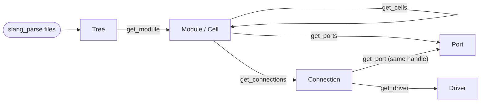
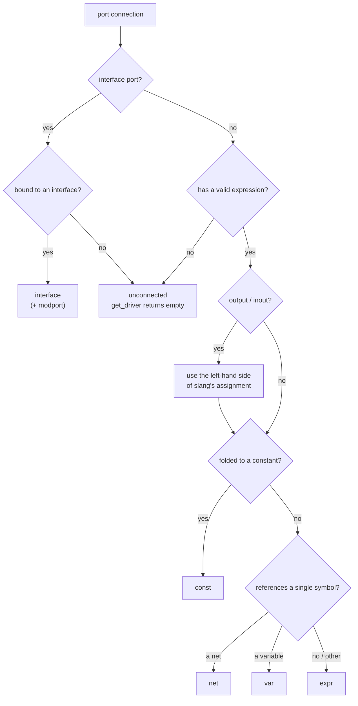
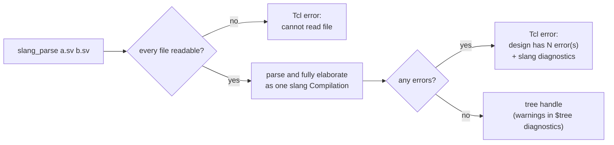
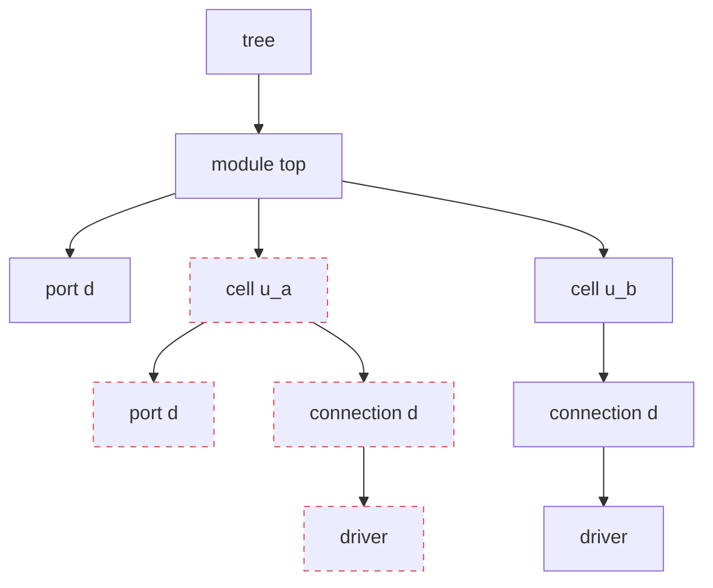
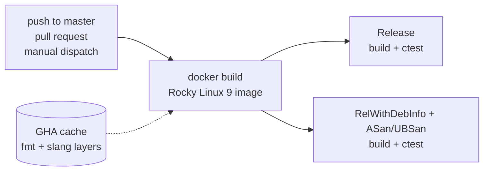
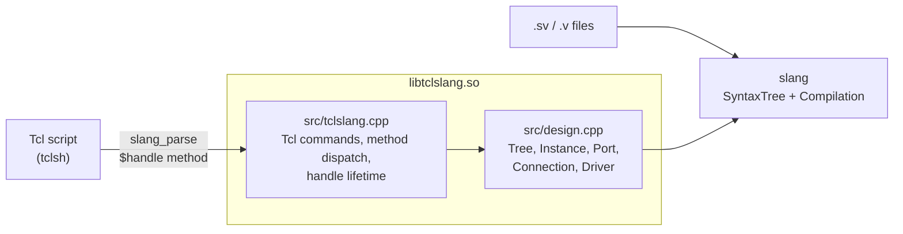

# tclslang

[](https://github.com/benastahl/tclslang/actions/workflows/ci.yml)

**Query elaborated SystemVerilog designs from Tcl.** tclslang is a Tcl extension built on the [slang](https://github.com/MikePopoloski/slang) compiler. It makes a design's modules, ports, instances and connectivity scriptable in the language that EDA flows already use. The design is fully elaborated, so parameters, generate blocks, instance arrays and interfaces are resolved the same way a simulator resolves them.

Developed by **Ben Stahl** · [github.com/benastahl/tclslang](https://github.com/benastahl/tclslang)

```tcl
load build/libtclslang.so

set tree [slang_parse rtl/top.sv rtl/alu.sv]
set top  [$tree get_module top]

foreach cell [$top get_cells] {
    puts "[$cell name] : [$cell ref_name]"
    foreach conn [$cell get_connections] {
        set d [$conn get_driver]
        puts "  .[$conn name] <- [expr {$d eq "" ? "(unconnected)" : [$d expr]}]"
    }
}
$tree destroy
```

Running [`examples/dump_hierarchy.tcl`](examples/dump_hierarchy.tcl) on [`tests/cases/generate_and_arrays.sv`](tests/cases/generate_and_arrays.sv):

```text
module top
  port d              input   logic[3:0]
  u_array[0] : cell_a    (top.u_array[0])
    .d            input   <- d[1:0]  (var logic[3:0])
  u_array[1] : cell_a    (top.u_array[1])
    .d            input   <- d[1:0]  (var logic[3:0])
  g_loop[0].u_gen : cell_a    (top.g_loop[0].u_gen)
    .d            input   <- d[i]  (var logic[3:0])
  g_loop[1].u_gen : cell_a    (top.g_loop[1].u_gen)
    .d            input   <- d[i]  (var logic[3:0])
  g_if.u_cond : cell_a    (top.g_if.u_cond)
    .d            input   <- d[3]  (var logic[3:0])
```

---

## Contents

- [Quick start](#quick-start)
- [API reference](#api-reference)
- [Errors and diagnostics](#errors-and-diagnostics)
- [Handle lifetime](#handle-lifetime)
- [Testing and CI](#testing-and-ci)
- [How it works](#how-it-works)
- [Roadmap](#roadmap)

---

## Quick start

### Docker (recommended)

The image is Rocky Linux 9, which is binary-compatible with RHEL 9. It builds fmt, slang (pinned) and tclslang, then runs the test suite:

```bash
docker build -t tclslang .      # ~3 min the first time; slang is the slow part
docker run --rm tclslang        # runs the full test suite (ctest)
```

To work on your own checkout inside the container, mount it and rebuild there:

```bash
docker run --rm -it -v "$PWD":/work tclslang bash
# inside the container:
make test                                          # configure, build, run ctest
tclsh examples/dump_hierarchy.tcl my_design.sv
```

The same targets are available from the host through the Makefile: `make docker` and `make docker-test`.

### Native build on RHEL / Rocky / Alma 9

The [Dockerfile](Dockerfile) is the reference. These are the same steps:

```bash
sudo dnf install -y dnf-plugins-core && sudo dnf config-manager --set-enabled crb
sudo dnf install -y gcc-c++ make cmake git python3 tcl tcl-devel pkgconf-pkg-config

# fmt >= 11.1 as a shared library (slang and tclslang must link the same one)
git clone --depth 1 --branch 11.1.4 https://github.com/fmtlib/fmt.git
cmake -S fmt -B fmt/build -DCMAKE_BUILD_TYPE=Release -DBUILD_SHARED_LIBS=ON -DFMT_TEST=OFF
cmake --build fmt/build -j"$(nproc)" && sudo cmake --install fmt/build

# slang, at the commit tclslang is tested against
git clone https://github.com/MikePopoloski/slang.git && git -C slang checkout 652a9ab5b4d093ff4f8fcf6e1e3fdcc7e292f931
cmake -S slang -B slang/build -DCMAKE_BUILD_TYPE=Release -DBUILD_SHARED_LIBS=ON \
      -DSLANG_INCLUDE_TESTS=OFF -DSLANG_INCLUDE_TOOLS=OFF -DSLANG_USE_MIMALLOC=OFF
cmake --build slang/build -j"$(nproc)" && sudo cmake --install slang/build --strip

# /usr/local/lib64 is not on the default loader path on EL
echo /usr/local/lib64 | sudo tee /etc/ld.so.conf.d/local.conf && sudo ldconfig

make test    # in this repo
```

**Requirements:** a C++20 compiler (GCC 11 or newer), CMake 3.20 or newer, Tcl 8.6, fmt 11.1 or newer, and slang.

---

## API reference

Every design object is a Tcl command, called a *handle*, and you call methods on it: `$handle method ?args?`. Each object has exactly one handle: asking for the same port twice returns the same handle. An unknown method returns Tcl's standard error listing the valid methods.



### `slang_parse file ?file ...?` → tree

Parses and elaborates the files as one design. It raises a Tcl error if a file can't be read or if the design has errors (see [Errors and diagnostics](#errors-and-diagnostics)).

### Tree

| Method | Returns |
|---|---|
| `get_module name` | Module handle. Returns a top-level instance of `name` if there is one, otherwise the shallowest instance of it. Raises an error if the design has none. |
| `top_modules` | List of the design's top-level module names |
| `diagnostics` | slang's formatted warnings, or `""` if there are none |
| `destroy` | Frees the tree **and every handle created from it** |

### Module and cell

`get_module` returns a module. `get_cells` returns cells, which are the instances directly inside another instance, including instances in generate blocks and instance arrays.

| Method | Returns |
|---|---|
| `name` | Module: the module name. Cell: its path below the parent, e.g. `u_core`, `g_loop[0].u_gen`, `u_array[1]` |
| `ref_name` | The module or interface being instantiated, e.g. `cell_a` |
| `hier_path` | Full hierarchical path, e.g. `top.g_loop[0].u_gen` |
| `get_ports` | Port handles, in declaration order |
| `get_cells` | Cell handles for the instances directly inside this one |
| `get_connections` | Connection handles, one per port of this instance |
| `destroy` | Frees this handle and everything obtained through it |

### Port

| Method | Returns | Example |
|---|---|---|
| `name` | Port name | `data_in` |
| `direction` | `input`, `output`, `inout` or `ref` (`""` for interface ports) | `input` |
| `kind` | `net`, `var`, `interface` or `multiport` | `net` |
| `data_type` | slang's type | `logic[7:0]` |
| `net_type` | Net type for net ports, otherwise `""` | `wire` |
| `width` | Total bits, including unpacked dimensions | `8` |
| `dimensions` | `{left right}` for each dimension, outermost first | `{{0 15} {3 0}}` |
| `interface` | Interface name for interface ports | `bus_if` |
| `modport` | Modport for interface ports, if any | `master` |

The difference between `net` and `var` is the one SystemVerilog makes: `input wire a` and `input a` are nets, while `input logic a` and `output reg a` are variables.

### Connection

| Method | Returns |
|---|---|
| `name` | Name of the port being connected |
| `get_port` | The port handle, the same one `$cell get_ports` returns |
| `get_driver` | Driver handle, or `""` if the port is unconnected |

### Driver

A driver describes what a port is hooked up to. `kind` is one of:

| `kind` | Meaning | Example connection |
|---|---|---|
| `var` | a variable, or a select of one | `.a(state)`, `.a(bus[3:2])` |
| `net` | a net, or a select of one | `.a(wire_sig)` |
| `const` | a constant expression | `.a(1'b1)`, `.a(WIDTH)` |
| `expr` | any other expression | `.a({x, z})`, `.a(x & z)` |
| `interface` | an interface instance, optionally through a modport | `.bus(the_bus.slave)` |

How a connection's driver is classified:



| Method | Available on | Returns |
|---|---|---|
| `kind` | all | See the table above |
| `expr` | all | Source text of the connection, e.g. `bus[3:2]` |
| `name` | all | Signal or interface name (`""` for `const` and `expr`) |
| `data_type` | `var`, `net`, `const`, `expr` | Declared type of the signal, or the type of the expression |
| `net_type` | `net` | e.g. `wire` |
| `const` | `const` | The value, e.g. `1'b1` |
| `modport` | `interface` | The modport name, or `""` |

Calling a method on a driver kind it doesn't apply to raises an error, for example `net_type is not available on a var driver`.

---

## Errors and diagnostics

Errors are reported through slang's own formatted diagnostics:



```text
% slang_parse tests/cases/err_trailing_comma.v
slang_parse: design has 1 error(s)
tests/cases/err_trailing_comma.v:9:48: error: misplaced trailing ','
    input wire [7:9] i_select, hello_there_haha,
                                               ^
% slang_parse /no/such/file.sv
slang_parse: cannot read "/no/such/file.sv": No such file or directory
% $tree get_module nope
module "nope" not found
```

Warnings don't fail the parse. They're available through `$tree diagnostics`.

---

## Handle lifetime

Every handle points into the slang compilation owned by its tree, so the tree owns every handle made from it:

```tcl
set tree [slang_parse top.sv]
set cells [[$tree get_module top] get_cells]
$tree destroy          ;# frees the compilation and deletes every handle above
info commands cell*    ;# -> nothing left
```

Handles form an ownership tree that mirrors how you obtained them. Destroying a node frees its whole subtree; here, `$u_a destroy` removes the dashed nodes and `$tree destroy` removes all of them:



- `$h destroy`, `rename $h {}` and interpreter teardown all free memory the same way.
- Destroying a handle also destroys its descendants. For example, destroying a module destroys the cells and ports you got through it.
- Calling a destroyed handle is an ordinary `invalid command name` error, not a crash.

---

## Testing and CI

```bash
make test                                     # or: cmake -B build && cmake --build build && ctest --test-dir build --output-on-failure
TCLSLANG_UPDATE_GOLDEN=1 ctest --test-dir build   # regenerate golden files after an intentional change
```

| Suite | What it covers |
|---|---|
| **Golden** ([`tests/cases`](tests/cases)), 14 cases | Each `.sv`/`.v` file, or directory for multi-file designs, is dumped by [`tests/lib/dump.tcl`](tests/lib/dump.tcl) and diffed against `<case>.golden`. The dump prints names and attributes only, never handle IDs, so the goldens don't change when handle numbering does. The cases cover generate blocks, instance arrays, interface ports, expression connections, port shapes, repeated instances, a multi-file design, and four files with syntax or elaboration errors. |
| **API** ([`tests/api.test`](tests/api.test)), 32 tests | tcltest checks of every method, the error messages, handle identity, and lifetime: cascade destroy, `rename`, and parse/destroy in a loop without accumulating handles. |
| **Example** | [`examples/dump_hierarchy.tcl`](examples/dump_hierarchy.tcl) runs as a smoke test so it can't drift from the API. |

**Sanitizers.** `-DTCLSLANG_SANITIZE=ON` builds the extension with AddressSanitizer and UndefinedBehaviorSanitizer and preloads the ASan runtime into the test processes, because `tclsh` isn't instrumented. Leak detection is on. The only suppression, in [`tests/lsan.supp`](tests/lsan.supp), is glibc's internal `dlerror` buffer. Use `RelWithDebInfo`, not `Debug`. slang's headers change class layouts when `NDEBUG` is unset, so a Debug build linked against a Release slang crashes inside slang.

```bash
cmake -B build-asan -DCMAKE_BUILD_TYPE=RelWithDebInfo -DTCLSLANG_SANITIZE=ON
cmake --build build-asan && ctest --test-dir build-asan --output-on-failure
```

**CI** ([`.github/workflows/ci.yml`](.github/workflows/ci.yml)) builds the Docker image and runs the full suite twice on pushes to `master`, on pull requests, and on manual dispatch: once as a Release build and once with ASan and UBSan. The GitHub Actions cache keeps the fmt and slang layers, so only tclslang rebuilds.



---

## How it works



```text
include/tclslang/design.hpp   slang-facing model: Tree, Instance, Port, Connection, Driver
src/design.cpp                elaboration, traversal, driver classification, diagnostics
src/tclslang.cpp              Tcl binding: one command per object, method dispatch, lifetime
tests/                        golden cases, dump library, tcltest API suite, LSan suppressions
examples/                     scripts that use the API
```

- **One owner.** A `Tree` owns its `SourceManager`, its syntax tree, its slang `Compilation`, and every object created from it. The `SourceManager` is declared first so it's destroyed last. Objects form a parent/child tree, so destroying a node destroys its subtree.
- **One object per thing.** Objects are cached by (kind, parent, slang pointer). That makes handles stable, and a connection's port is the same handle as the cell's port. Keying by parent also keeps cell paths correct when slang shares one body between identical instances.
- **Tcl-native commands.** `Tcl_CreateObjCommand` stores the object in `clientData`, and its delete proc frees that object's subtree. Method names are resolved with `Tcl_GetIndexFromObj`.
- **Traversal.** Cells are found by walking an instance body through generate blocks (skipping uninstantiated branches) and instance arrays, without descending into other instances.
- **Drivers.** Output and inout connections are bound by slang as assignments, and the driver is taken from the left-hand side. A connection is `const` if slang folded it to a constant, `var` or `net` if it references a single symbol, and `expr` otherwise. The text comes from the expression's source range, because slang synthesizes some nodes without syntax, such as implicit conversions and per-element array connections.

---

## Roadmap

- **Real-flow inputs:** use slang's `Driver` for filelists (`-f`), `+incdir`, `+define` and `--top`.
- **DV-oriented examples:** generate an instantiation or testbench skeleton from a module's ports, and report unconnected or undriven ports.
- **Packaging:** `pkgIndex.tcl` and a CMake install target, so `package require tclslang` works without `load`.
- **slang version:** move from a pinned commit to a tagged slang release.

---

## License

MIT. See [LICENSE](LICENSE).
